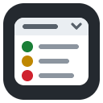
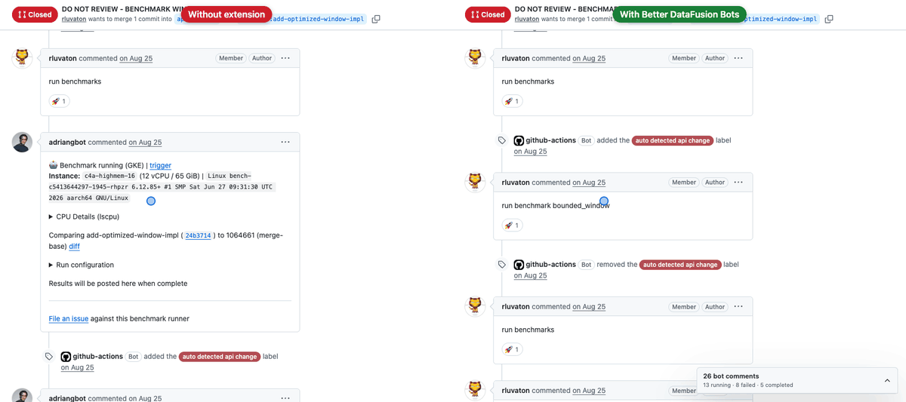
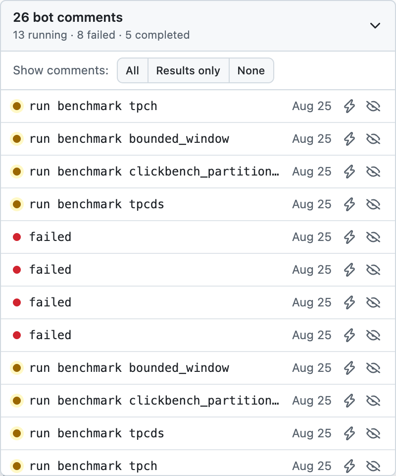
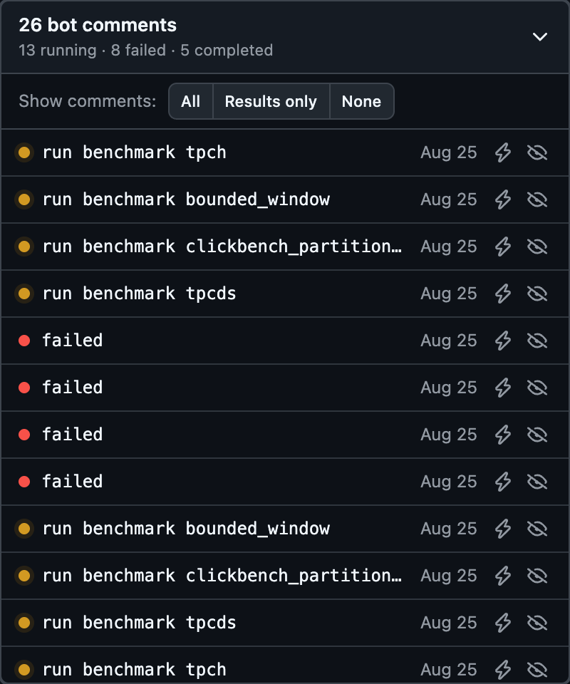
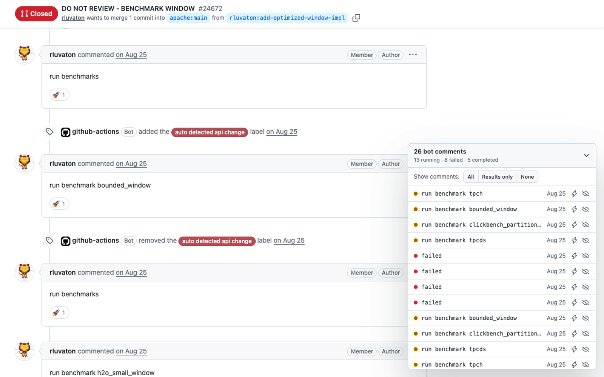
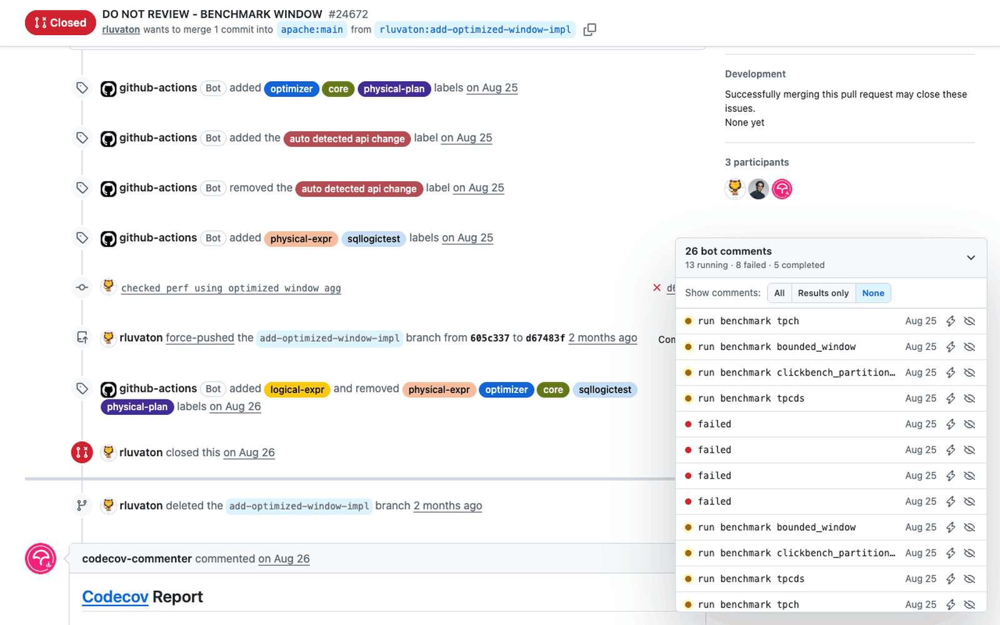
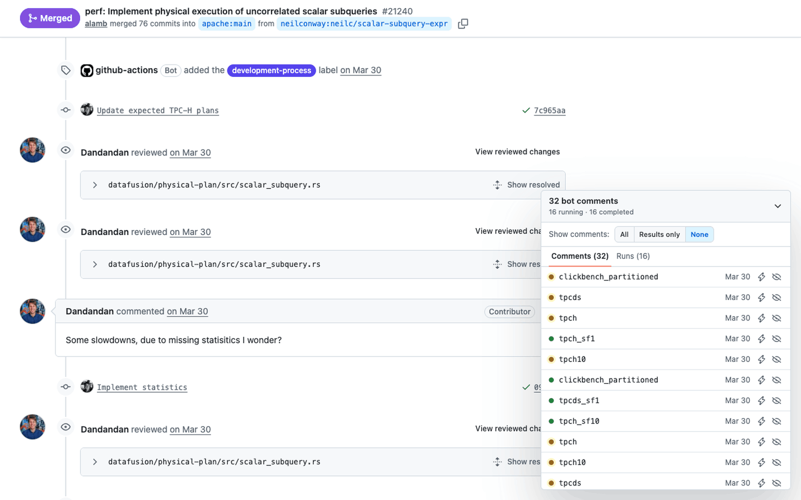
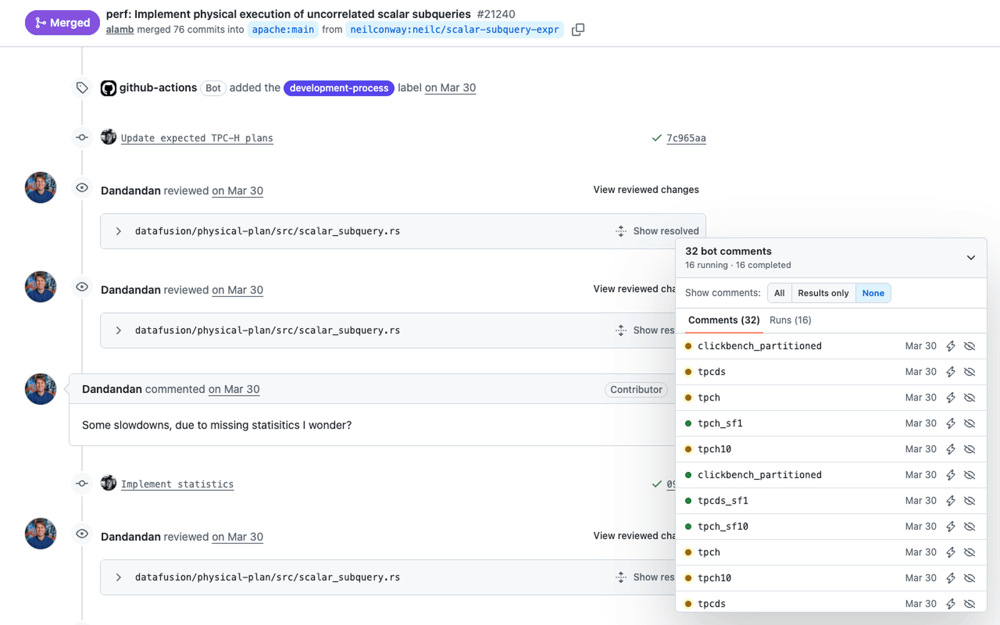

<h1> Better DataFusion Bots</h1>

A browser extension that folds the benchmark bot's comments on [apache/datafusion](https://github.com/apache/datafusion) pull requests into a compact status panel, so you can read the human conversation again.



## Features

### A status panel instead of a flooded timeline

Every benchmark bot comment (`adriangbot`) is hidden from the timeline and listed in a floating panel instead. Each row shows the run's status (🟡 running, 🟢 completed, 🔴 failed), which benchmark ran, and when. GitHub hides long timelines behind "Load more", and the extension expands it automatically so no bot comment is missed. The panel follows GitHub's light and dark themes.

 

### Show all / none

**Show comments: All** brings every bot comment back into the timeline, and **None** folds them away again.



### Reveal a single comment

Click 👁 on a row to bring back just that comment. The page scrolls to it and highlights it. Click again to hide it.



### Jump to the trigger

Click ⚡ on a row to jump to the human `run benchmark …` comment that started that run.



### Results only

**Results only** shows the completed benchmark results and keeps running and failed status updates hidden.


### Turn it off from the toolbar

Click the extension's toolbar icon to turn it off on every PR. All bot comments come back, the panel goes away, and the icon turns grey (). Click it again to turn it back on (). Open tabs update immediately, and the setting is remembered. Pin the extension (puzzle-piece menu → 📌) to keep the button in the toolbar.



<sub>The browser toolbar can't be captured, so the GIF shows a stand-in button with the real icon.</sub>

### Collapse the panel

Click the panel's header to collapse it to a one-line summary, and click again to expand it.


## Install

It's a plain Manifest V3 extension with no build step.

### Chrome / Edge / Brave / Arc

1. Clone this repo.
2. Open `chrome://extensions` (on Edge, `edge://extensions`).
3. Turn on **Developer mode** (top-right).
4. Click **Load unpacked** and select the cloned folder.
5. Open any `https://github.com/apache/datafusion/pull/*` page.

After pulling updates, click ↻ on the extension's card and refresh the PR tab.

### Firefox (temporary)

1. Open `about:debugging#/runtime/this-firefox`.
2. Click **Load Temporary Add-on…** and select `manifest.json`.

Firefox removes temporary add-ons when it restarts. Firefox doesn't run Manifest V3 background service workers, so the toolbar on/off button doesn't work there; the extension stays on.

## Development

```sh
npm install
npx playwright install chromium
npm test                          # offline, against saved PR snapshots
LIVE=1 npm test                   # also runs the live "Load more" test against github.com
node tests/save-fixtures.mjs      # refresh the PR snapshots (logged-out browser)
npm run screenshots               # regenerate docs/ images and GIFs from the live PR (needs ffmpeg)
npm run screenshots -- reveal-comment   # regenerate only some GIFs
npm run icons                     # re-render icons/*.png from icons/icon.svg
node open.mjs [PR-URL]            # open a Chromium window with the extension loaded
```

The list of bot accounts and the comment-matching regexes live at the top of `content.js`. See [CLAUDE.md](CLAUDE.md) for how the README images are produced and checked.
